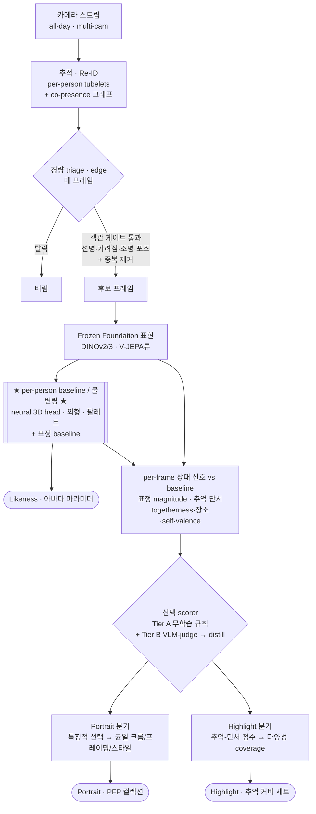

# 포트레이트 · 하이라이트 · Likeness — 아키텍처 설계 (모던 스택)

> 인사이트 로그(`selection_insights.md`)의 원리를 *구현*으로. v0.1
> 핵심 원리: **per-person 자기-상대 선택 on frozen 표현.** 단순한 원리 · 모던 스택 · curation-free.

## 한 문장

사람을 추적 → frozen foundation 표현에서 그 사람의 *baseline*을 추정(= Likeness) → 모든 프레임을 baseline *대비 편차/풍부함*으로 점수 → 선택(Portrait / Highlight).

## 파이프라인

## 단계

**S0 · 추적 / Re-ID** — multi-cam 스트림 → per-person tubelet. 다중인물 추적 → *co-presence 그래프*(togetherness용). [foundation detector / tracker / Re-ID]

**S1 · 경량 triage (edge, 매 프레임)** — 객관 게이트(#4): 선명(블러)·가려짐(가시성)·조명·포즈 + 중복 제거. 통과분만 heavy로. [distilled 경량 인코더 + 빠른 landmark/pose] — 캐스케이드 빠른 차선.

**S2 · Frozen Foundation 표현 (heavy, 후보에만)** — 일반 시각/얼굴 인코더(DINOv2/3류) + 비디오 인코더(V-JEPA류, 반응 동역학). *감정-과제 학습 모델 아님.* 세 출력 공유 substrate.

**S3 · per-person baseline / 불변량 ★keystone★** — p의 깨끗·중립 프레임 *집계*:
- 정체성/기하 → neural 3D parametric head(FLAME류 + feed-forward) → 정규화 랜드마크 · 블렌드셰입
- 외형 → 헤어/의상 *연속 임베딩* + 컬러 팔레트(픽셀 통계)
- 표정 baseline → foundation 공간에서 p의 중립 중심 추정 (magnitude의 기준)
- → **Likeness 출력** + Portrait/Highlight의 기준.

**S4 · per-frame 상대 신호 (vs baseline)** —
- 표정 magnitude = baseline 거리 (감정 카테고리 ✗)
- 추억 단서: togetherness(co-presence · joint attention) · 장소 가시성 · self-presence(p 알아봄) · valence · 스릴(magnitude + 동역학)

**S5 · 선택 scorer** —
- **Tier A (무학습, v0):** Portrait = 게이트 → 특징적 선택(magnitude 스위트스팟). Highlight = 추억-단서 점수 → *submodular 다양성 커버*.
- **Tier B (모던 upgrade):** VLM-as-judge로 *confident pairwise* 비교 *생성*(사람 큐레이션 0) → frozen feature 위 *작은 ranker로 distill*. confident만, ties 기권. *사람-내부 상대*로만 사용(VLM conventional prior 완화).

**S6 · 출력 조립** — Likeness = 파라미터 → 생성/아바타. Portrait = 선택 → *균일 크롭/프레이밍/스타일* → PFP 컬렉션. Highlight = 다양성 커버 세트.

## 세 출력 = 한 substrate의 세 읽기

| 출력 | 연산 | baseline과의 관계 |
|---|---|---|
| **Likeness** | 불변량 *추출·집계* | baseline = 그 자체 |
| **Portrait** | *특징적* 깨끗 프레임 선택 | 저~중 magnitude + 게이트 |
| **Highlight** | *추억-피크 다양성* 선택 | 고 magnitude + 추억 단서 |

## certainty / curation-free 매핑

- **#1** 상대·top-set·confident → Tier B는 confident pairwise만, ties 기권. 선택은 항상 *p 내부 상대*.
- **#2** 방향 not density → magnitude/ranker는 *방향*, 전형성 안 봄.
- **#3** 연속 not 카테고리 → 표정=magnitude, 헤어=연속+retrieval, 감정분류 없음.
- **#4** 논리곱 분해 → S1 객관 게이트(대부분 큐레이션0), 어려운 표정만 상대 축.
- **curation-free** → 우리 학습 0(Tier A) 또는 VLM이 큐레이트(Tier B). 사람 라벨 없음.

## 평가 (모던 rigor)

- 절대 정확도 ✗ → *상대/confident*: held-out 비교 일치율, "top-set에서 골랐나" recall.
- Highlight: 차원 coverage 메트릭.
- Likeness: 기하 재현 오차.
- *간판 결과*: 무학습 Tier A를 표준 highlight/aesthetic 벤치마크에서 *감독 SOTA 대비* — "단순한데 경쟁력."

## 빌드 순서

1. **S0+S1+S2** (추적·triage·frozen feature) — 뼈대.
2. **S3 baseline / Likeness (keystone)** — 먼저. neural 3D head + 표정 baseline.
3. **Tier A 선택** (Portrait/Highlight v0) — 동작하는 end-to-end.
4. **균일 컨테이너(PFP)** + Highlight 다양성 커버.
5. **Tier B** (VLM-judge → distill) — 어려운 축 업그레이드 + 벤치마크.
