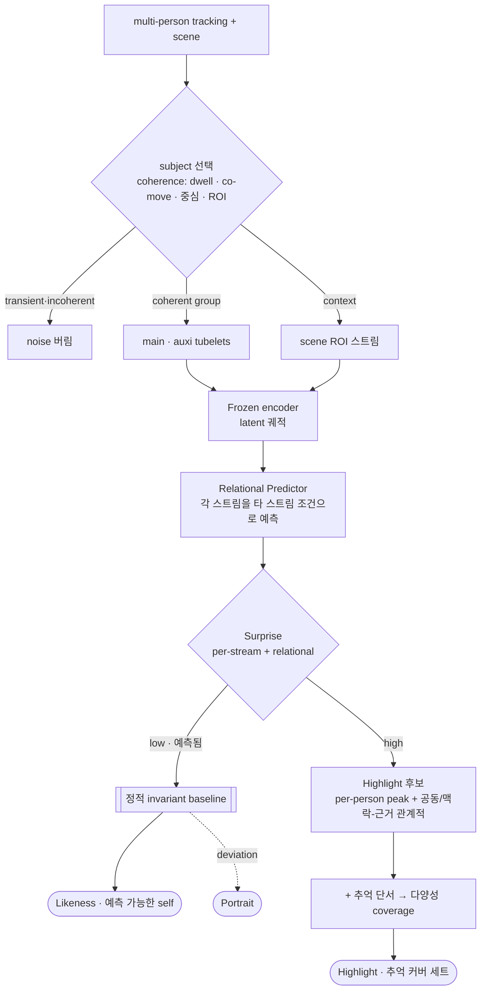

# 예측 World-Model 아키텍처 — Twelve Labs ∩ AMI 방향

> `selection_insights.md`(원리) · `architecture_design.md`(일반 모던 스택)의 *특화 버전*.
> 방향: **predictive video world-model + surprise-salience.** SSL · energy-based · label-free.
> v0.2 — {main, auxi, scene} 스트림 + tubelet 간 관계(relational) 분석 추가.

## 중심 thesis

**사람의 예측 world-model.** 모델이 p의 최근 latent 궤적으로 *다음*을 예측.

- **예측(predictable) = Likeness** — 안정된 self.
- **예측 오차(surprise) = Highlight** — 예상 못 한 기억할 순간. *특히 관계적 surprise*(아래).
- **Portrait** = 그 사이 — 안정 self로부터의 특징적 deviation, 깨끗하게.

→ *한 모델의 두 얼굴*: 확신하는 baseline(Likeness) vs 틀리는 지점(Highlight). **salience = surprise.** energy-based · 비생성 · label-free.

## 파이프라인

## 입력 — subject 선택 (coherence)

multi-person tracking + scene → *모든* tubelet. main/auxi/noise 라벨은 추적이 안 줌.
*coherence 기준*으로 subject 그룹 선별 (= curation-free · instance-internal):

- 지속성(dwell): 경험 내내 vs 순간적.
- co-presence / 공동 이동: 함께 머물고 같이 움직이는 그룹.
- 중심성 / foreground, 라이드 ROI 게이팅.

→ *지속·공동이동·중심* 그룹 = subject. transient·incoherent = noise 탈락.
main vs auxi: 등록/체크인 / 휴리스틱 / *역할은 product 단*(지각 단은 대칭 모델링).

## 세 스트림

- **main** — 사람 tubelet (self / 반응 / Likeness)
- **auxi** — 사람 tubelet (togetherness)
- **scene** — context-ROI 스트림 (장소 정체성 + 반응이 응답하는 맥락). *사람 아님.*

## Keystone — relational 예측 baseline

frozen encoder latent 궤적 위에서:

- **정적 invariant baseline** (Likeness/Portrait) — low-surprise latent 집계. neural 3D head · 외형 · 팔레트.
- **Relational Predictor** (동적) — 각 스트림을 *타 스트림 조건으로* 예측(main ← main-과거 + auxi + scene). 단일-스트림 isolation 아닌 관계적.
- **Surprise** s_t = energy(z_t, ẑ_t) — *per-stream* + *relational*(아래)로 읽음.
- 학습: frozen 일반 encoder(감정-과제 ✗) + *경량 relational predictor를 raw 무라벨 영상에 SSL*. 라벨0.

## tubelet 간 관계 (relational 분석) — 최고의 highlight가 사는 곳

- **co-surprise (main ↔ auxi)** — 동시 surprise = *공유 기억 순간*(togetherness peak). 같이 비명/폭소. 단독보다 강한 신호.
- **context-grounded (사람 ↔ scene)** — 반응이 *scene 이벤트로 설명*되면 coherent(좋은 기억), 안 되면 noise/딴 데. predictor를 scene에 조건걸어 구분.
- **best highlight = 관계적 surprise** — "우리가 그것에 *함께* 반응했다" = 공유 기억의 정수.
- **double duty** — subject를 *선택*한 co-presence/coherence 구조가 highlight를 *풍부하게*도 함. *한 관계 구조, 두 용도.*

## 크럭스 — predictability 캘리브레이션

predictor를 *얼마나 강하게?* 너무 강 → highlight까지 예측, surprise 소멸. 너무 약 → 다 surprise.
목표: *추억-순간 = 정확히 high-surprise 잔차*. 핸들 = predictor 용량/context 제한, routine은 예측하되 peak는 잔차로. surprise는 *표현 보존* 표현에서(general encoder). predictability/compressibility 트레이드오프 — 핵심 실험·publishable.

## 세 출력 (예측 관점)

| 출력 | 예측 모델에서 |
|---|---|
| **Likeness** | *확신하는 baseline* (low surprise) → 불변량 추출 |
| **Portrait** | 안정 self로부터 *특징적 deviation* (mid) + clean + 균일 컨테이너 |
| **Highlight** | *prediction error* (high), *특히 관계적*(co-surprise · grounded) + 추억 단서 → 다양성 coverage |

## 재사용 (`architecture_design.md`)

- S1 경량 triage(객관 게이트 + dedup) — 캐스케이드
- S4 추억 단서 · S6 출력 조립(균일 컨테이너, coverage)

## 이중 프레이밍

- **Twelve Labs** — surprise = *학습/감독-없는 video moment localization* + *관계적/multi-agent moment*. 표준 벤치마크 대비.
- **AMI / LeCun** — salience = 사람-조건 *관계적* 예측 모델의 prediction error. energy-based · 비생성 · label-free.

## 빌드 순서 (keystone-first)

1. **subject 선택**(coherence) → {main, auxi, scene} 스트림.
2. **Keystone**: frozen encoder latent → relational predictor(SSL on raw) → per-stream + relational surprise.
3. **Likeness**: low-surprise 집계 → neural 3D head · 팔레트.
4. **Highlight v0**: high(per-stream + relational) → 추억 단서 → coverage.
5. **Portrait**: deviation + clean + 균일 컨테이너.
6. 크럭스 튜닝 + video 벤치마크(Twelve Labs) + world-model 프레이밍(AMI).

## 배우는 것 (성장 payoff)

V-JEPA류 적응 · *relational / multi-stream* SSL predictor · energy-based salience · world-model 프레이밍 · video moment eval. — 모던 스택을 *이해*로.
